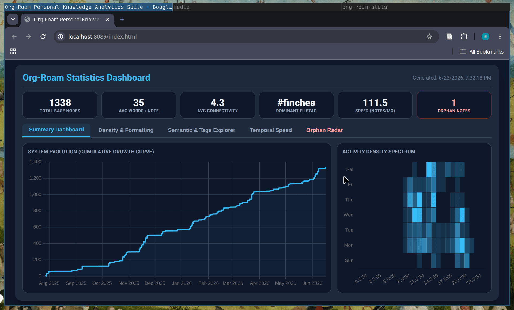
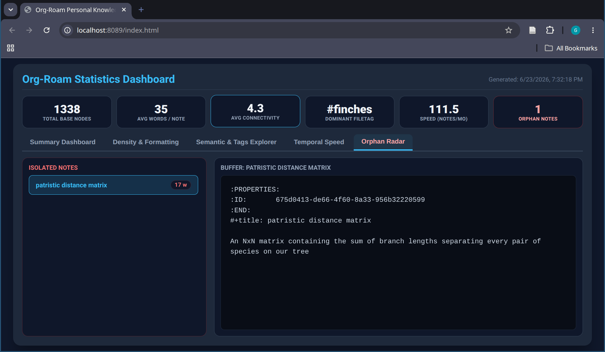
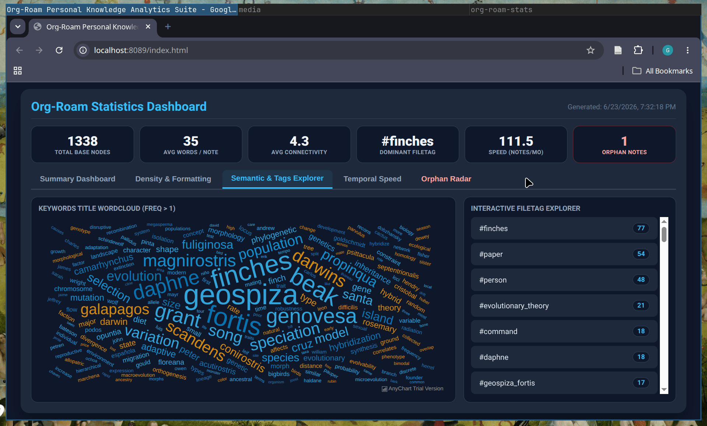

# org-roam-stats: A visual dashboard for org-roam knowledge management.


**Table of Contents**

- [Installation](#installation)
- [Usage](#usage)
- [Features ✨](#features-)
- [License](#licence)

Org-Roam-Stats creates an interactive, browser-based dashboard for your [org-roam](https://github.com/org-roam/org-roam) notes, letting you track note creation over time, find orphaned nodes, and filter your knowledge base by file tags.

It is designed for researchers, writers, and anyone who wants to understand the **shape and health** of their knowledge base, not just its content.

## Installation

### From source 

#### Clone repo

`org-roam-stats` is not yet on MELPA, but you can use it from the GitHub repo:

```bash

git clone https://github.com/GerardoCendejas/org-roam-stats.git

```

### Emacs config

```emacs-lisp

(use-package org-roam-stats
       :after org-roam
       :ensure nil ; Use `:ensure nil` if you are loading from source
       :load-path "~/.emacs.d/lisp/org-roam-stats/"  ; Adjust path as needed
       :bind (("C-c m o" . org-roam-stats-open)) ; Or the keybinding of your choice
       :config
       (org-roam-stats-mode 1) ; This enables the minor mode for automatic logging of note creation timestamps.
       :custom
       (org-roam-stats-log-file "~/.emacs.d/org-roam-stats-log.org")) ; Path to the log file for note creation timestamps (if dont want the default)

```

### Customization

You can customize the package via `M-x customize-group org-roam-stats`.

- `org-roam-stats-port`: Port for the local HTTP server (default `8089`).
- `org-roam-stats-log-file`: Path to the org file where creation timestamps are logged.

## Usage

### Logging Note Creation

`org-roam-stats-mode` automatically hooks into `org-roam-capture-new-node-hook` to record the exact creation timestamp of every new node. Enabling the minor mode in your config activates this hook.

### Opening the Dashboard

- Run `M-x org-roam-stats-start` (or your bound key).
- Your default browser will open the visualization.

## Features ✨

### Time Tracking

See when your notes were created with a histogram that shows note creation over time. Spot productive streaks, quiet periods, and the overall growth of your knowledge base.



### Orphan Tracking

Quickly identify nodes with no connections — no backlinks and no outgoing links. These orphaned notes are easy to miss but often represent ideas worth integrating into your wider graph.



### Tag Filtering

Filter the entire dashboard by `#+filetag:` tags. Focus on a specific domain, project, or context to get a scoped view of just the notes that matter right now.



## Licence

GPLv3
